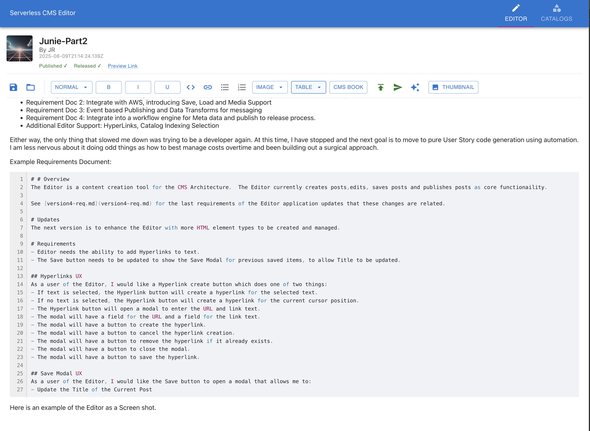

# CMS Editor

This is a web-based Content Management System (CMS) Editor built with React and TypeScript. It provides a rich text editing experience with support for tables, images, and authentication.

[](https://github.com/Serverless-Cloud-CMS/cms-editor/actions/workflows/ci.yml)


## Features
- Rich text editing
- Table and image support
- Catagory Support
- User authentication
- AWS CMS CRUD integration
- Modern UI with theming

## Image of Editor UI


## Getting Started
The Editor requires AWS Cognito to be set up. See the [AWS Cognito documentation](https://docs.aws.amazon.com/cognito/latest/developerguide/cognito-user-identity-pools.html) for more information.

You can use the local/editor Terraform and CloudFormation template to deploy a test AWS Cognito setup and S3 buckets for local testing.

To learn more about setting up Cognito and using the Editor, check out the [Serverless CMS Book Part 2](https://github.com/Serverless-Cloud-CMS/serverless-cms-book/blob/main/ServerlessCMS-Part2.pdf) that describes this approach.

```aiignore
    AuthConfig: {
        ClientId: import.meta.env.VITE_CLIENTID,
        IdentityPoolId: import.meta.env.VITE_IDENTITYPOOLID,
        AppWebDomain: import.meta.env.VITE_APPWEBDOMAIN,
        TokenScopesArray: ['openid'],
        RedirectUriSignIn: import.meta.env.VITE_REDIRECTURISIGNIN,
        RedirectUriSignOut: import.meta.env.VITE_REDIRECTURISIGNOUT,
        IdentityProvider: '',
        UserPoolId: import.meta.env.VITE_USERPOOLID,
        AdvancedSecurityDataCollectionFlag: false
    },
```

All values are provided as environment variables and can be set up using the Terraform and CloudFormation templates provided.

### Prerequisites
- Node.js (v18 or later recommended)
- npm or yarn
- Docker (for containerized builds)
- AWS User Pool and App client Setup

### Installation
1. Clone the repository:
   ```sh
   git clone <repo-url>
   cd cms-editor
   ```
2. Install dependencies:
   ```sh
   npm install
   # or
   yarn install
   ```

### Running Locally
Start the development server:
```sh
npm run dev
# or
yarn dev
```
The app will be available at `http://localhost:3000` (default Vite port).

## Docker Easy Instructions

### Build and Run Docker Image
To build the Docker image:
```sh
./docker-run.sh --mount-source #Mounts the source for easier development
```

# Docker Manual Instructions

### Run Docker Container
To run the application in a Docker container:
```sh
docker run -p 8080:80 cms-editor
```
The app will be available at `http://localhost:3000`.

### Using Docker Compose (Optional)
If you have a `docker-compose.yml` file, you can use:
```sh
docker-compose up --build
```

## Project Structure
- `src/` - Main source code (components, helpers, editor plugins)
- `public/` - Static assets
- `docker/` - Dockerfile and related scripts
- `scripts/` - Utility scripts

## Testing
Run tests with:
```sh
npm test
# or
yarn test
```

## License
MIT

